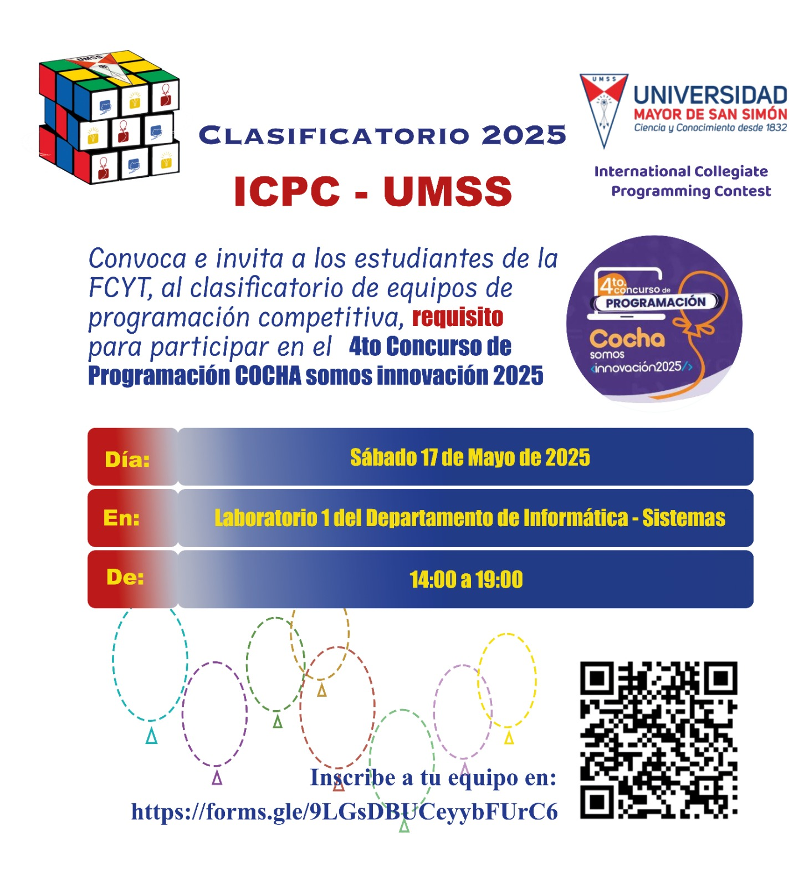
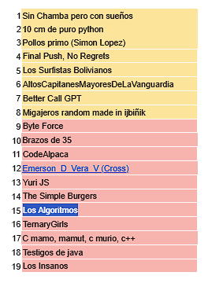

# clasif-17-05-25
Repositorio con enunciados de los problemas y soluciones de la competencia clasificatoria de la Universidad Mayor de San Simón (UMSS) para el ICPC 2025 y clasificar para el 4to Concurso de Programación COCHA Somos Innovación 2025.

- **Nombre del equipo:** Los Algoritmos (znolly)
- **Plataforma:** Vjudge
- **Contest:** [https://vjudge.net/contest/717750#rank](https://vjudge.net/contest/717750#rank)

Clasificación oficial:

